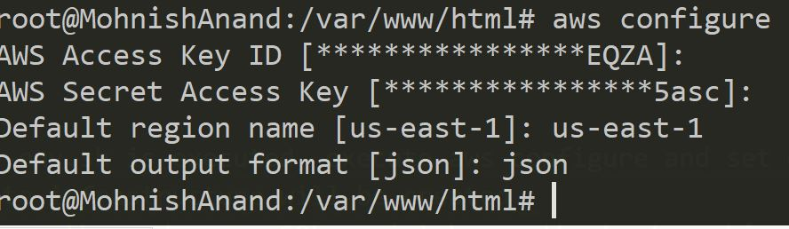
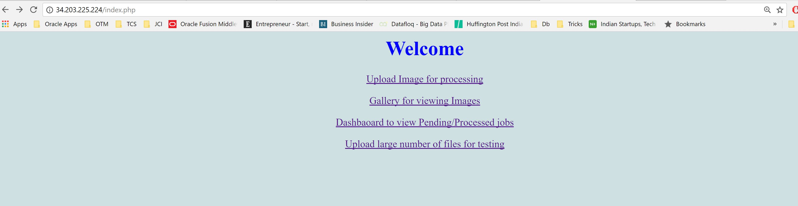
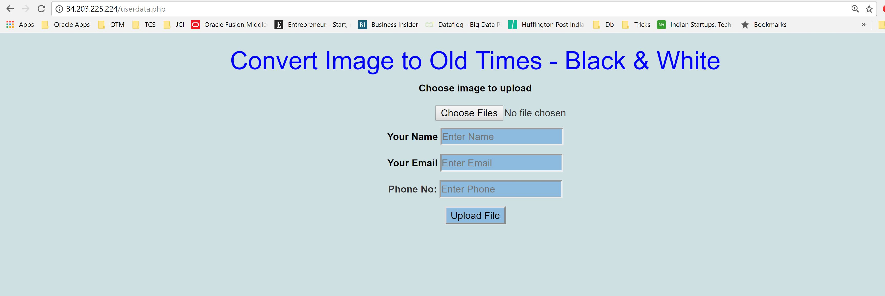
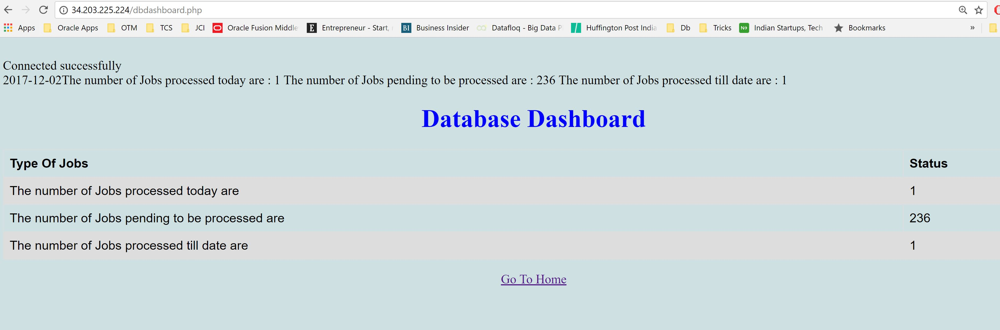
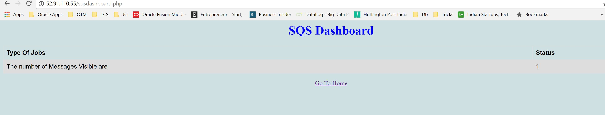
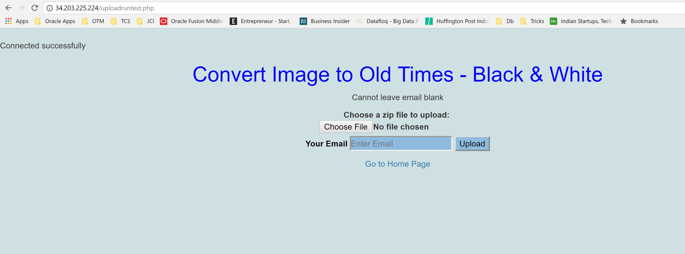
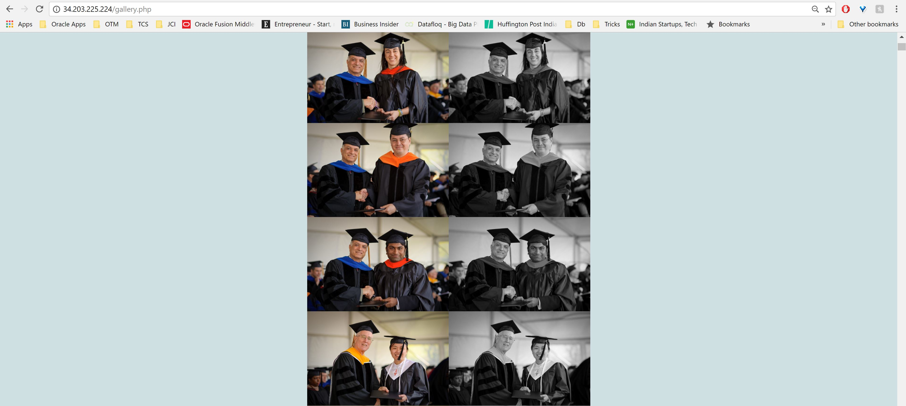
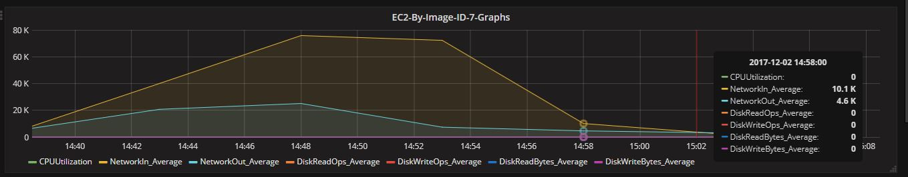
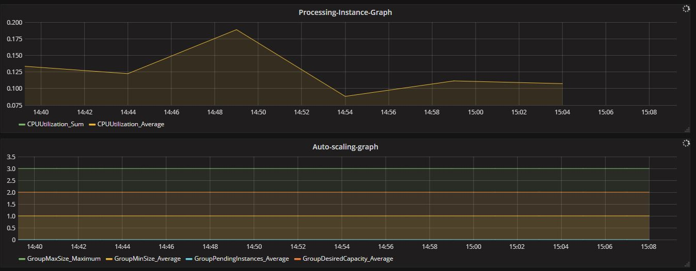
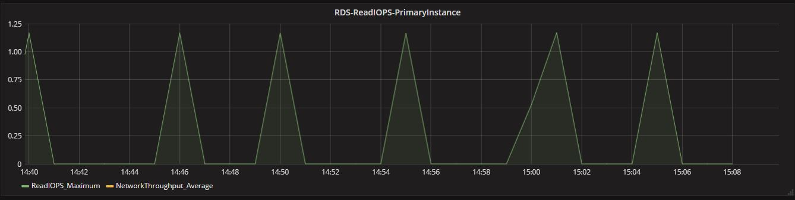

## Gallery App - Convert Images to OLD Times : Black & White

### Before Running the code, do this -
 1. Run aws configure , on the machine you will run the code from. Set Default region and Default output to us-east-1 and json.
 
 2. Install MYSQL client - sudo apt-get install mysql-client-core-5.7
 3. Get the below values for your aws account [ALL should be from US-EAST-1 Region ONLY - otherwise script will fail]
  1.  Security group id - Port 22,80,3000 and 3306 should be open (INBOUND) to source 0.0.0.0/0 . [in us-east-1 region]
  2.  Key pair name - this is to launch the instance. [us-east-1 region]
  3.  IAM Role Name - it should have FULL ACCESS Policies attach for S3,RDS,SNS,SQS,EC2,CloudWatch. [ at Global Level]
  4. VPC ID - note the vpc-id for default VPC from your us-east-1 region.

### How to run the code ?
 1. Download the git repo to a location.
 2. From the location cd to root of the repo
 3. Type sh create-env.sh
 4. It will ask for various inputs, enter them, such as [This will create the infrastructure and deploy the code].
  * 1. Keypair name
  * 2. Security Group name
  * 3. IAM Role name
  * 4. Minimum instance for Auto Scaling Group
  * 5. Maximum instances for Auto Scaling Group
  * 6. VPC ID
 5. To Launch the Dashboard integrated with CloudWatch, location the IP address of the EC2 instance running with image-id ami-ae69f0d4 and open ip-address:3000 (grafana-gold-3). Login with username and password admin, admin.
 6. To Launch the application, get the LoadBalancer URL from the AWS Console and open it in browser.

 ### Destroy the App ?
 1. cd manand1/ITMO544/MP-3 on the location where the git repo was downloaded.
 2. sh destroy-env.sh

 ### About the Application ?
  1. The name of the application is Create Images to Old Times - Black and White.
  2. The application takes an image file as an input from the user and converts it into a back and white image. It also notifies the user when the image has been processed.
  3. The application supports functionality to upload zip file and convert multiple images.
  4. Application can be monitored using the Dashboard. Dashboard is integrated with CloudWatch and reports all the metrcis.
  5. Application shows number of jobs pending to get processed, link is availble on home page.

### Limitations in the App ?
 1. Currenly only supports Jpg and Png file extenions for images.

### What has changed since MP2?
 1. Added Date Processed field to database for tracking the processed jobs.
 2. Port 3000 was added to INBOUND rules in security group, this is to access Grafana instance.
 3. Installed below to support unzip of files on instances -
   * sudo apt-get install php-zip
   * sudo apt-get install php5.6-zip
 4. Grafana instance launches from a gold image created on AWS.

### What has changed since MP1?
 1. The system is broken down into small components. The first part is where user uploads image to system and second part where image is processed and converted into black and white image.
 2. When image is converted, system sends an email with the URL of the processed image to user.
 3. The processing system polls every 5 minutes to check for new jobs to be processed.
 4. In MP-2, I have included a new field in database to store Unique ID associated with the image being uploaded. This unique id helps to identify jobs which needs to be processed.

### Screenshots

#### ** References
 1. https://aws.amazon.com/articles/processing-images-with-amazon-web-services/?tag=articles%23keywords%23php
 2. W3schools PHP and HTML code snippets
